

# THE HANGMAN

  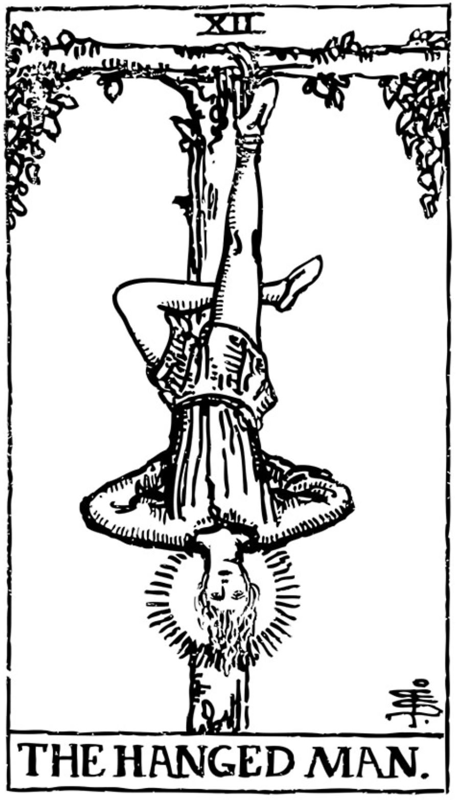

The Hangman é um projeto em grupo, realizado em sala para obtenção de nota na matéria de Linguagem de Programação I.
Tendo como objetivo ser uma opção de entretenimento digital, possindo duas modalidades de jogo: Individual ou Dupla.

Na modalidade individual, o jogador é desafiado a completar uma palavra aleatória. Na modalidade dupla, um dos jogadores insere a dica e a palavra de seu desejo para desafiar seu amigo a completar no jogo.

## Tecnologias

Linguagem C - CLion

## Funcionalidades

- Adicionar palavras ao banco de palavras
- Jogar o jogo da forca com palavras aleatórias do banco
- Jogue em dupla desafiando um amigo

## Como executar

- Clone o repositório em seu disco C;

    git clone https://github.com/DigsRodrigues/Forca

- Navegue até o diretório do projeto 

    cd Forca/cmake-build-debug

- Execute o jogo:

    ForcaC

## Interfaces

### Menu principal

  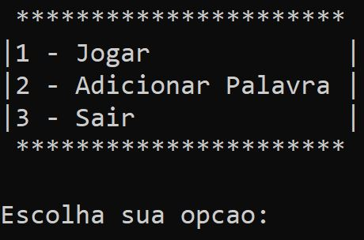

### Jogar

  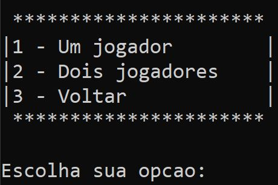

### Adicionar Palavra

  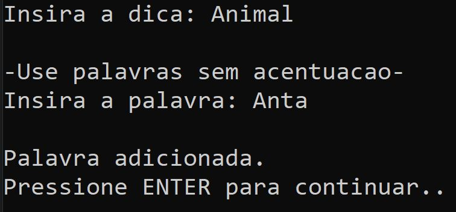

### Jogo

#### 1 Jogador

  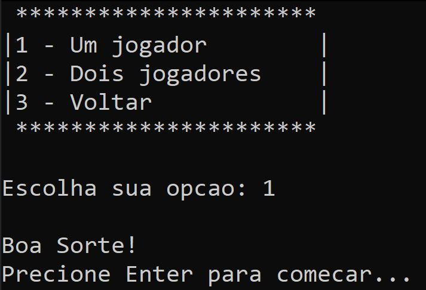

#### Tentativas

  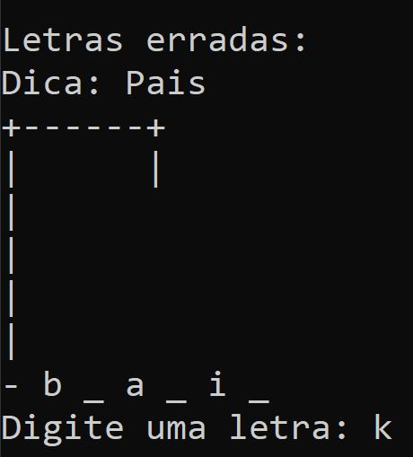

  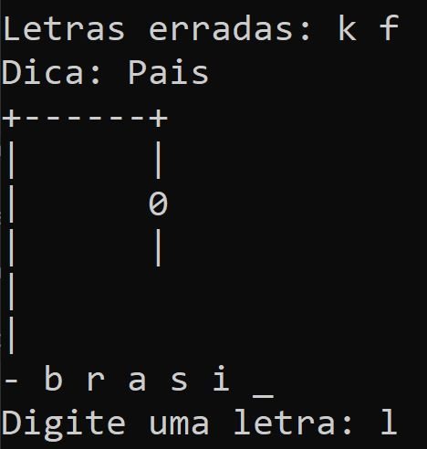

#### Venceu

  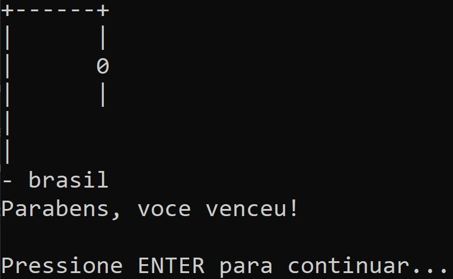

#### Perdeu

  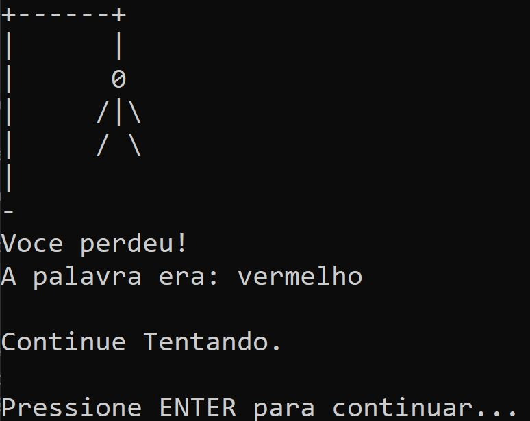

### 2 Jogadores

  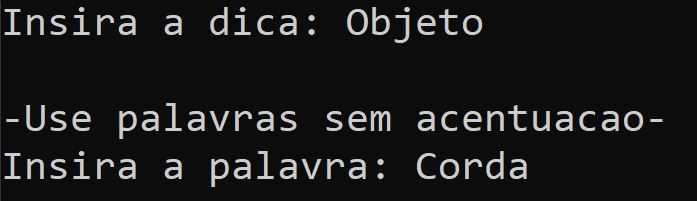

  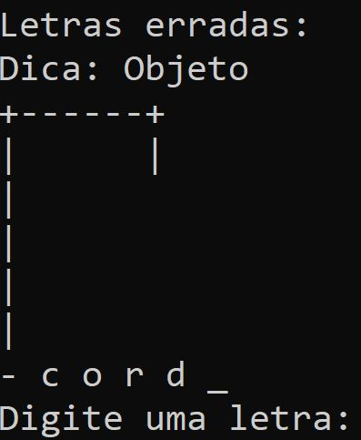

## Autores

    Cristovão Machado Silva
    Diego Henrique Rodrigues
    Felipe Alves de Paiva
    Guilherme Gomes Oliveira
    Guilherme Henrique Andrade de Lima
